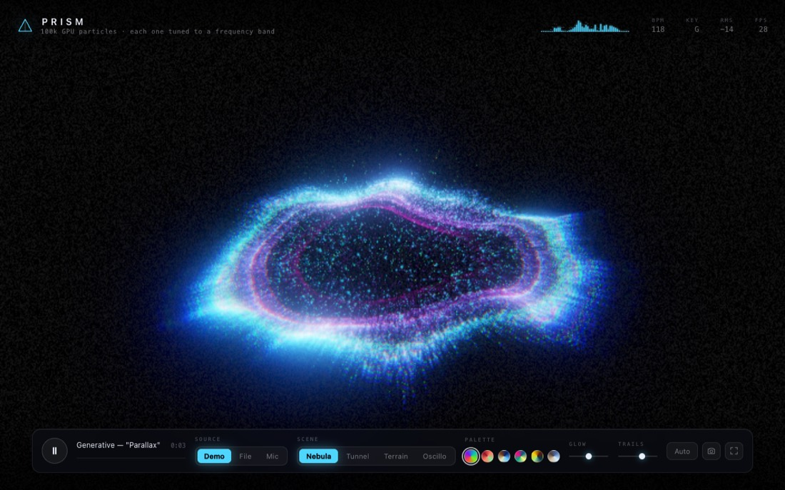
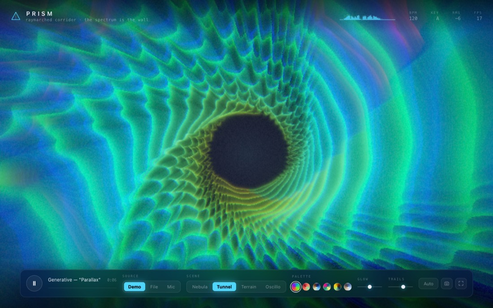
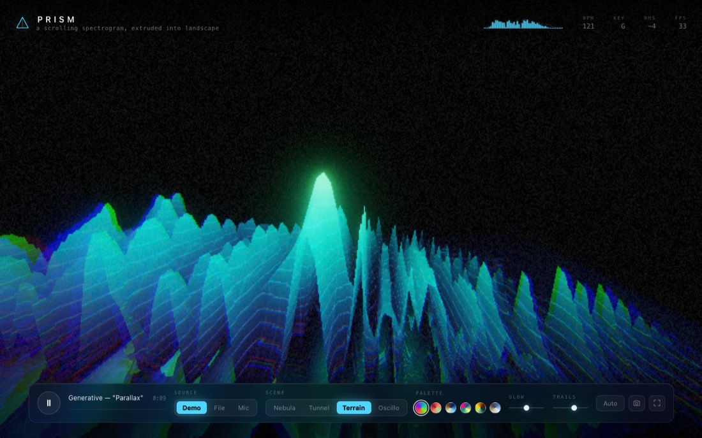
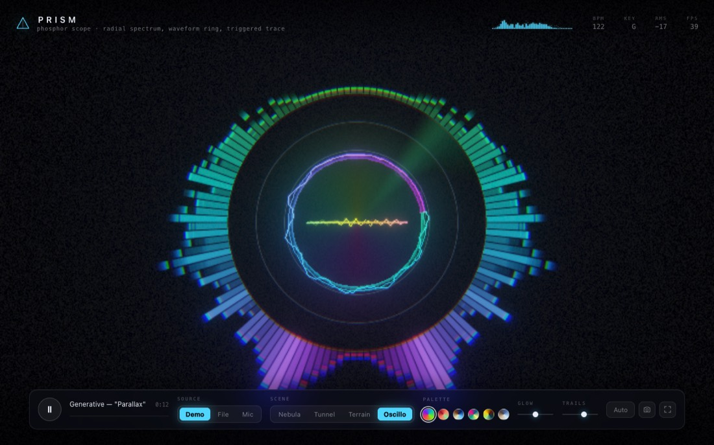

# PRISM

**An audio-reactive visual instrument for the browser.**

Real-time spectral analysis, onset detection and a phase-locked beat clock drive four GPU
scenes. Bring your own track, sing into the microphone, or let the built-in generative piece
play — there are no audio or texture assets anywhere in this repository, everything you see
and hear is produced at runtime.

```bash
npm start
```

That is the whole setup. The script installs dependencies on first run, boots Vite and opens
your browser at `http://localhost:5173`. Node 18+ required.

| | |
| --- | --- |
|  |  |
|  |  |

<sub>Captured by the headless smoke test on a software rasteriser — a real GPU is sharper and
considerably faster.</sub>

---

## What it does

### Listening

`src/audio/Analysis.ts` is a small DSP stage that turns a 4096-point FFT into things a
visual can actually use:

| Feature | How it is derived |
| --- | --- |
| **128 log-spaced bands** | Bin groups from 28 Hz to 16.5 kHz, RMS per group, a +4.2 dB/octave pink-tilt so the top end stays alive, fast-attack / slow-release envelopes. |
| **Auto gain** | A rolling loudness reference aims the loudest recent moment at −11 dBFS, so a quiet demo and a mastered track fill the screen identically. |
| **Onsets** | Rectified spectral flux against a rolling **median** threshold (median, not mean — it ignores the sustained energy a mean would drag upward). |
| **Tempo** | Inter-onset intervals folded into a 62–185 BPM histogram with harmonic folding and exponential decay; the peak is the tempo. |
| **Beat clock** | A phase-locked loop free-runs at the detected tempo and is *nudged* — never snapped — toward each onset. Choreography stays smooth through missed beats and breakdowns. |
| **Chroma & hue** | Bins folded to 12 pitch classes, then averaged as vectors **around the circle of fifths** so that harmonically adjacent keys get adjacent hues. Every scene's colour follows the music's key. |
| **Brightness, flux, drift** | Spectral centroid, flux magnitude, and the gap between fast and slow loudness (positive while a track builds, negative when it drops out). |

The analysis runs on the main thread in roughly 0.2 ms per frame.

### Looking

Four scenes, each a different way of reading the same signal:

| | Scene | What it is |
| --- | --- | --- |
| `1` | **Nebula** | ~100k particles simulated entirely on the GPU with ping-ponged float textures. Curl noise for turbulence, differential rotation for spiral arms, and a flattening force that collapses the cloud into a disc — which lifts back into a sphere when the track gets airy. Each particle is assigned one frequency band and orbits on that band's ring, so the galaxy *is* the spectrum. Onsets fire a shockwave from the core. |
| `2` | **Tunnel** | A volumetric raymarch. The tunnel wall's radius is the spectrum folded around the circumference; rings travel toward you, flutes ripple with the highs, and the whole corridor twists on the bar. Glow is accumulated along the ray rather than shaded at a surface, so the walls read as light rather than geometry. |
| `3` | **Terrain** | A 128 × 220 spectrogram history held in a float texture ring buffer and extruded into landscape, with a mirrored reflection underneath. Rows are pushed on a fixed 60 Hz clock so scroll speed never depends on frame rate. |
| `4` | **Oscillo** | A phosphor scope. A radial spectrum ring (bass at six o'clock, sweeping up both sides to treble) around a live waveform loop and an XY Lissajous trace — the trace plots the signal against itself delayed by a quarter period *of whatever note is currently sounding*, so a pure tone draws a circle and richer material opens into a knot. Long feedback persistence supplies the phosphor decay. |

### Finishing

A hand-written post chain in `src/gfx/Post.ts`, no addons:

- optional **frame feedback** with per-scene zoom and spin, giving trails without runaway gain
- **dual-filter bloom** — soft-knee prefilter, 5-level Kawase downsample, additive tent upsample
- one **composite pass** doing radial chromatic aberration, ACES tone mapping, vignette,
  luminance-weighted film grain and ordered dithering

Everything renders into half-float targets and is tone-mapped exactly once, at the end.

### Keeping up

Frame time is smoothed and the render scale is walked between 0.55× and 1× every 0.9 s.
The visualiser sheds resolution — never features, never particles — so the frame rate holds
without the picture changing character. The raymarcher additionally scales its step count to
the canvas area.

---

## Using it

| Key | |
| --- | --- |
| `space` | play / pause |
| `1` – `4` | choose a scene |
| `←` `→` | previous / next scene |
| `P` | next palette |
| `A` | auto-cycle scenes every 16 bars |
| `O` | open an audio file |
| `M` | switch to the microphone |
| `D` | back to the generative track |
| `S` | save the current frame as a PNG |
| `F` | fullscreen |
| `H` | hide the interface |
| `?` | key reference |

**Drop an audio file anywhere on the page** to play it — WAV, MP3, FLAC, OGG, M4A, anything
the browser can decode. The interface fades out after a few seconds of stillness, so it is
presentable on a projector as-is.

**Glow** and **Trails** scale each scene's own preferred bloom and feedback settings rather
than overriding them, so a scene tuned for heavy persistence stays heavier than one that is not.

The six palettes are cosine gradients (`colour(t) = a + b·cos(2π(c·t + d))`) — four vec3s
each, crossfaded over 0.8 s, and shared by every shader through one uniform block.

---

## The demo track

`src/audio/DemoTrack.ts` synthesises "Parallax": 122 BPM, A minor, i–VI–III–VII, arranged
into eight eight-bar sections that loop. Kick, snare, hats, sub bass, plucked arpeggio, pad,
lead and riser are all built from oscillators and noise, glued together with a convolution
reverb whose impulse response is generated at startup and a dotted-eighth feedback delay.

A lookahead scheduler (25 ms tick, 140 ms horizon) places events on the audio clock rather
than on `setTimeout`, so the timing does not drift when the tab is busy. A small xorshift PRNG
varies the lead motif each pass, which means the visualiser is never fed the exact same audio
twice.

It exists so the project demonstrates itself with nothing downloaded — but the whole point is
to drop your own music on it.

---

## Layout

```
src/
  audio/
    AudioEngine.ts     WebAudio graph; demo / file / microphone sources
    Analysis.ts        FFT → bands, onsets, tempo, beat clock, chroma
    DemoTrack.ts       the generative track
  core/Palettes.ts     cosine-gradient palettes and their crossfade
  gfx/
    Visualizer.ts      renderer, scene lifecycle, adaptive resolution
    Post.ts            feedback · bloom · composite
    GPGPU.ts           ping-ponged float-texture simulation buffers
    Quad.ts            full-screen triangle
    Scene.ts           the scene contract
    glsl.ts            shared shader chunks (palette, simplex, curl, hashes)
    scenes/            Nebula · Tunnel · Terrain · Oscillo
  ui/UI.ts             HUD, controls, keyboard, drag-and-drop
  main.ts              wiring and the frame loop
scripts/
  start.mjs            the one-command launcher
  smoke.mjs            headless browser test
```

## Scripts

| | |
| --- | --- |
| `npm start` | install if needed, then dev server + browser |
| `npm run dev` | dev server only |
| `npm run build` | production bundle into `dist/` |
| `npm run preview` | serve the production bundle |
| `npm run typecheck` | `tsc --noEmit` |
| `npm run smoke` | headless Chrome: loads the app, visits every scene and palette, fails on any console error, blank canvas or clipped-white frame, and writes screenshots to `.smoke/` |

## Requirements

A browser with WebGL2 and WebAudio — recent Chrome, Edge, Firefox or Safari. Float render
targets are required for the particle simulation; if the context cannot be created the page
says so instead of showing a black screen.

## Licence

MIT.
